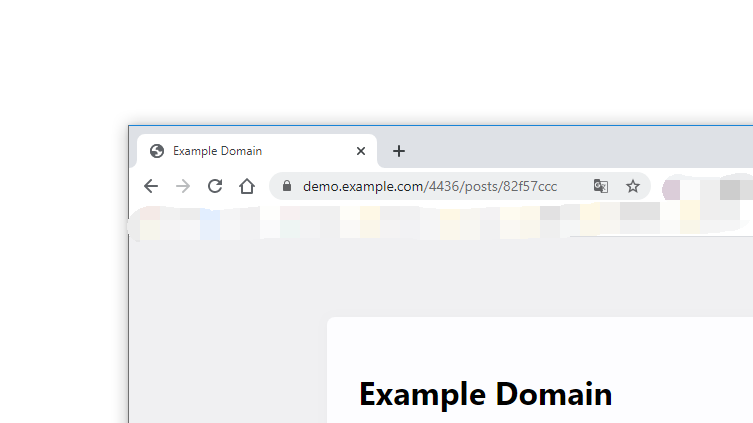
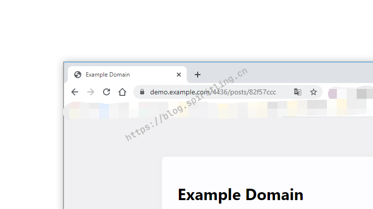

<div align="center">

# hexo-images-watermark


[](https://travis-ci.com/SpiritLingPub/hexo-images-watermark) [](https://www.npmjs.com/package/hexo-images-watermark) [](https://www.npmjs.com/package/hexo-images-watermark) [](https://spdx.org/licenses/GPL-3.0-only.html)

</div>

一款用于 Hexo 静态博客网站生成时对图片添加水印。

不对原图产生任何影响，在网站静态页构建过程中将原图读取，输出添加了水印的图片。

在构建的静态网站中不会存在原图，只存在水印图片。

> **一定要阅读最后的提示事项，包含现有版本的支持情况和即将添加的功能**

使用 `npm` 安装插件

```shell
npm install hexo-images-watermark
```

在站点配置文件 `_config.yml` 中进行如下配置：

```yml
watermark:
    enable: true
    textEnable: true
    rotate: -45
    gravity: centre
```

在 `hexo generate` 运行时会自动为你的 `_post` 目录下的图片添加水印，新的图片将会放到 `public` 目录中对应的位置。

[安装问题解决](https://github.com/SpiritLingPub/hexo-images-watermark/wiki)

[查看支持类型](#todo-list)

## 必备配置参数

### `enable`

**默认值**：无
**说明**：`true` 将会执行图片添加水印，`false` 将会不执行添加

### `textEnable`

**默认值**：false
**说明**：是否使用文本来添加水印（❌ 警告：目前不支持文本和图片同时添加水印）

### `imageEnable`

**默认值**：false
**说明**：是否使用图片来添加水印（❌ 警告：目前不支持文本和图片同时添加水印）

## 其他参数

### `text`

**默认值**：使用配置文件中的 url，一旦 url 不存在直接显示作者名字（SpiritLing）
**说明**：当你使用的文字过长时，一旦转为图片后大于待加水印的图片尺寸，则会出现错误。

### `fontPath`

**默认值**：undefined，使用 `text-to-svg` 自带字体
**说明**：自己加载需要的字体，支持单个字体文件，不区分中英文；如果纯中文，请只加载中文字体，例：需要加载 `source/static/font/custom.ttf` 字体直接将其写入到配置文件中即可

### `color`

**默认值**：rgb(169,169,167)
**说明**：颜色可以使用 rgb,rgba,#xxxxxx 以及 red 名字式的。⚠️ 只对 text 有效

### `gravity`

**默认值**：southeast
**说明**：设置水印位置处于什么方向，以 `上北下南左东右西` 来确定

参数可用值：

| 类型      | 说明 | 备注       |
| --------- | ---- | ---------- |
| centre    | 中央 | 图片正中间 |
| north     | 北   | 上方中间   |
| west      | 东   | 左边中间   |
| south     | 南   | 下边中间   |
| east      | 西   | 右边中间   |
| northwest | 东北 | 左上角     |
| southwest | 东南 | 左下角     |
| southeast | 西南 | 右下角     |
| northeast | 西北 | 右上角     |

### `fontSize`

**默认值**：18
**说明**：文本字体大小，⚠️ 只对 text 有效

### `watermarkImage`

**默认值**：watermark.png
**说明**：水印图片，放置在 source 文件根路径的图片名称；⚠️ 大小不要超过任何一张文章中的图片，否则会出错，可以搭配缩放进行使用

### `width`

**默认值**：50
**说明**：对图片进行缩放。⚠️ 只对 image 有效

### `height`

**默认值**：50
**说明**：对图片进行缩放。⚠️ 只对 image 有效

### `rotate`

**默认值**：0
**说明**：旋转角度，如`45`代表逆时针 45 度，`-45`代表顺时针 45 度

### `background`

**默认值**：transparent
**说明**：配合 text 和 rotate 使用，指的是文字转成的图片一旦旋转会出现多余空白，设置这些地方的颜色，一般透明色即可

### `bigSkip`

**默认值**：true
**说明**：是否跳过水印图片比原始图片大的，false，不跳过，按照原始图大小进行缩放，不保证缩放后的质量

## 例子

### 图片大于水印图片

-   原图



-   处理后



#### 图片小于水印图片，并且 bigSkip 为 false

-   原图


-   处理后


#### 动态图

-   原图


-   处理后


## TODO LIST

-   [x] 文字水印
    -   [x] 自定义文字，颜色，大小
    -   [x] 自定义字体 - 2019-12-24 Done
    -   [ ] 支持循环添加
    -   [x] 超限处理
-   [x] 图片水印
    -   [x] 自定义水印图片
    -   [ ] 远程水印图片
    -   [ ] 支持循环添加
    -   [x] 超限处理
-   [x] 位置
    -   [x] 固定位置：九个方位
    -   [ ] 自定义 top，left
-   [x] 旋转
-   [x] 缩放（仅限图片）
-   [x] 其他格式支持
    -   [x] GIF 动图
        -   [x] 固定位置：中间

## 使用注意事项 ⚠️⚠️⚠️

1. 暂不支持图片和文字共同添加
2. 只支持`source/_posts`文件夹下的图片，也就是文章本地图片
3. 水印图片也不支持远程和非 soucre 根路径下的文件，也是只支持 `*.jpg`,`*.jpeg`，`*.png` 三种格式静态图片
4. 动态图只支持 `source/_posts` 下的 `*.gif` 图片
5. 不支持循环满图添加水印
6. 请使用 `1.1.x` 以上版本， `1.0.x` 是进行 Hexo api 相关测试时使用的，版本杂乱无章，使用 `1.0.x` 版本出现任何问题，概不理会
